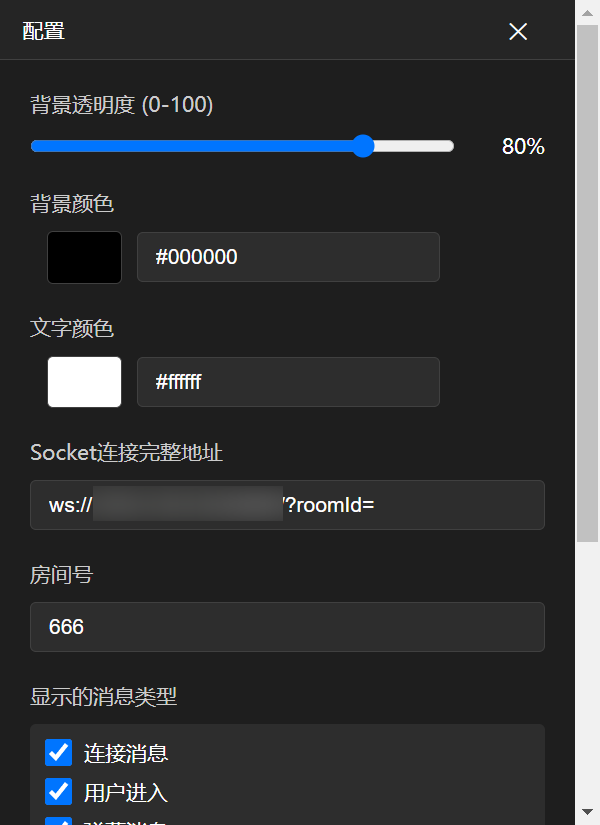
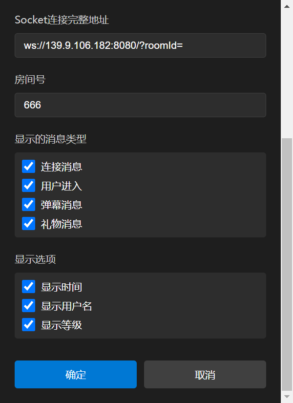
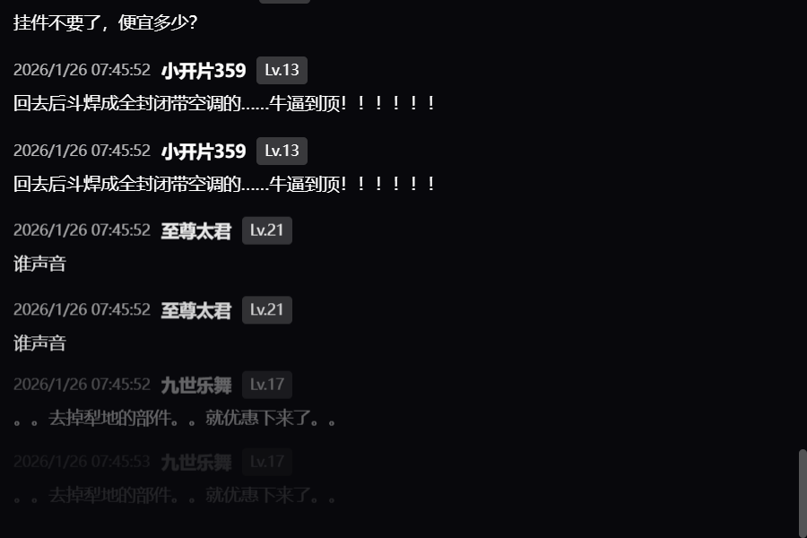

# 斗鱼弹幕客户端

一个基于 Electron 的斗鱼直播弹幕显示客户端，支持实时显示弹幕、礼物、用户进入等消息。

## 预览截图

<div align="center">
  
  <p><i>主界面 - 实时弹幕显示</i></p>
</div>

<div align="center">
  
  <p><i>配置界面 - 可视化设置</i></p>
</div>

<div align="center">
  
  <p><i>运行效果 - 透明背景置顶显示</i></p>
</div>

## 功能特性

- 🎨 自定义背景颜色和透明度
- 🎨 自定义文字颜色
- 🔌 可配置的 WebSocket 连接地址
- 📺 支持多种消息类型（弹幕、礼物、用户进入等）
- 👁️ 可选择显示/隐藏时间、用户名、等级
- 🪟 窗口置顶、透明背景
- 🖱️ 可拖动、可调整大小
- ⚙️ 可视化配置界面

## 安装

```bash
# 安装依赖
npm install

# 启动应用
npm start
```

## 配置

所有配置都存储在 `config.json` 文件中。

**配置文件位置：**
- **开发模式**：项目根目录 `D:\yhn\Project\DouYuDmClient\config.json`
- **打包后**：用户数据目录
  - Windows: `C:\Users\你的用户名\AppData\Roaming\douyu-dm-client\config.json`
  - macOS: `~/Library/Application Support/douyu-dm-client/config.json`
  - Linux: `~/.config/douyu-dm-client/config.json`

### 方式一：通过界面配置

1. 运行应用
2. 右键点击窗口
3. 选择"配置"
4. 修改配置项
5. 点击"确定"保存

### 方式二：手动编辑配置文件

1. 关闭应用
2. 编辑 `config.json` 文件
3. 保存文件
4. 重新启动应用

### 配置项说明

```json
{
  "backgroundColor": "#000000",      // 背景颜色（十六进制）
  "backgroundOpacity": 80,           // 背景透明度（0-100）
  "textColor": "#ffffff",            // 文字颜色（十六进制）
  "socketUrl": "ws://...",           // WebSocket 连接地址
  "roomId": "123456",                // 房间号
  "windowSize": {                    // 窗口大小
    "width": 600,
    "height": 400
  },
  "messageTypes": {                  // 显示的消息类型
    "connected": true,               // 连接消息
    "uenter": true,                  // 用户进入
    "chatmsg": true,                 // 弹幕消息
    "gift": true                     // 礼物消息
  },
  "displayOptions": {                // 显示选项
    "showTime": true,                // 显示时间
    "showNickname": true,            // 显示用户名
    "showLevel": true                // 显示等级
  }
}
```

## 使用说明

### 连接房间

1. 打开配置窗口
2. 填入 WebSocket 连接地址（例如：`ws://139.9.106.182:8080/?roomId=`）
3. 填入房间号
4. 点击"确定"
5. 应用会自动连接并显示弹幕

### 窗口操作

- **移动窗口**：按住鼠标左键拖动
- **调整大小**：拖动窗口边缘
- **打开配置**：右键 → 配置
- **退出应用**：右键 → 退出

### 消息类型

- 🔗 **连接消息**：显示 WebSocket 连接状态
- 👋 **用户进入**：显示用户进入房间的消息
- 💬 **弹幕消息**：显示用户发送的弹幕
- 🎁 **礼物消息**：显示用户赠送的礼物

## 项目结构

```
DouYuDmClient/
├── config.json          # 配置文件（唯一配置源）
├── main.js              # 主进程
├── renderer.js          # 渲染进程（主窗口）
├── config.js            # 配置窗口逻辑
├── index.html           # 主窗口界面
├── config.html          # 配置窗口界面
├── styles.css           # 样式文件
├── package.json         # 项目配置
├── CONFIG_FLOW.md       # 配置流程说明
└── README.md            # 项目说明
```

## 开发

### 开发模式

```bash
# 启动应用并打开开发者工具
npm start -- --dev
```

### 打包发布

#### 安装打包工具

```bash
npm install
```

#### 打包命令

```bash
# 打包当前平台
npm run build

# 打包 Windows 版本（生成安装包和便携版）
npm run build:win

# 打包 macOS 版本
npm run build:mac

# 打包 Linux 版本
npm run build:linux
```

#### 打包输出

打包完成后，安装包会生成在 `dist` 目录中：

**Windows:**
- `斗鱼弹幕客户端 Setup 1.0.0.exe` - 安装版
- `斗鱼弹幕客户端-1.0.0-portable.exe` - 便携版（无需安装）

**macOS:**
- `斗鱼弹幕客户端-1.0.0.dmg` - DMG 安装包
- `斗鱼弹幕客户端-1.0.0-mac.zip` - ZIP 压缩包

**Linux:**
- `斗鱼弹幕客户端-1.0.0.AppImage` - AppImage 格式
- `斗鱼弹幕客户端_1.0.0_amd64.deb` - DEB 安装包

#### 注意事项

1. **首次打包** - 第一次打包时会下载依赖，可能需要较长时间
2. **图标文件（可选）** - 如需自定义图标，请添加：
   - Windows: `icon.ico` (256x256)
   - macOS: `icon.icns` 
   - Linux: `icon.png` (512x512)
3. **配置文件** - 首次运行时会自动创建默认配置文件，无需手动创建

#### 打包后的配置文件位置

应用会将配置文件保存在用户数据目录，确保配置可以正常读写：

- **Windows**: `C:\Users\你的用户名\AppData\Roaming\douyu-dm-client\config.json`
- **macOS**: `~/Library/Application Support/douyu-dm-client/config.json`
- **Linux**: `~/.config/douyu-dm-client/config.json`

首次运行时，应用会自动创建默认配置文件，然后通过右键菜单打开配置界面进行设置即可。

### 配置管理

详细的配置管理流程请参考 [CONFIG_FLOW.md](./CONFIG_FLOW.md)

**核心原则：**
- 配置完全存储在 `config.json` 文件中
- 代码不包含配置对象
- 通过 IPC 通信读取和写入配置
- 支持手动编辑配置文件

## 技术栈

- [Electron](https://www.electronjs.org/) - 跨平台桌面应用框架
- WebSocket - 实时通信
- Node.js - 文件操作和进程管理

## 注意事项

1. **房间号为空时不会连接** - 请先配置房间号
2. **配置实时生效** - 修改配置后会自动重新连接
3. **窗口拖动时锁定大小** - 避免误操作改变窗口大小
4. **配置文件格式** - 必须是有效的 JSON 格式

## 许可证

MIT
